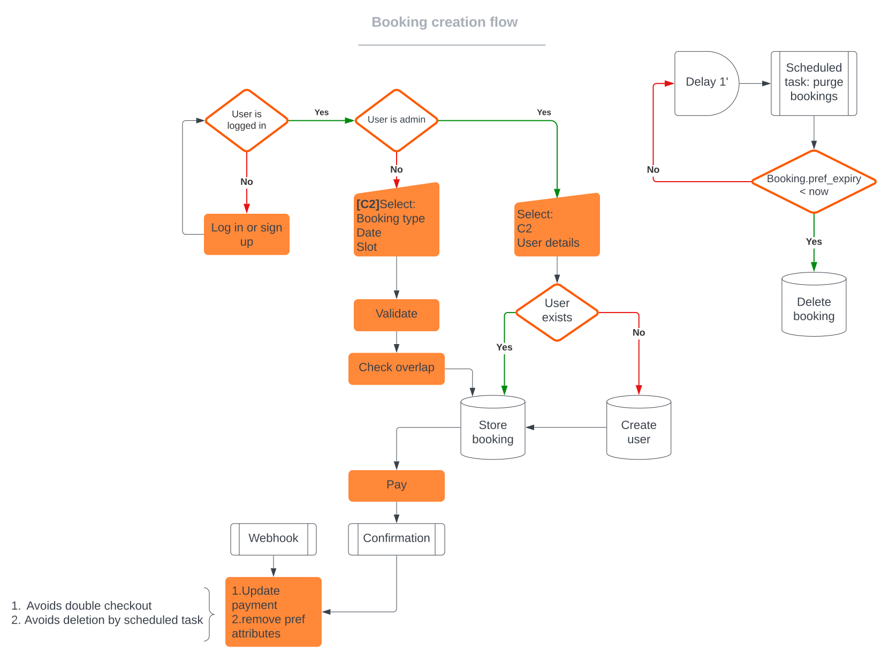

# Alirey

A booking management system built in the TALL stack (TailwindCSS, AlpineJS, Laravel & Livewire). This doc attempts to describe what each section does and how it works.

## TO DO

Livewire calendar 
+ Navigation
+ Clean up unused event click stuff
+ Translate carbon 

Check scheduled job logging stuff (It's not currently doing anything)

Use filament tables

Create users table in admin panel and allow admin to edit users

Error reporting form

Contact form (route('contact'))

update.blade.php
- Delete it, view is not being used anymore

config
- Dissallow deleting slots with pending bookings. Offer to create dummy bookings on this slot forever. Or delete the relationship between booking and slot and just give bookings a start time
- Allow therapist to create single-slot holidays

BookingController->edit()
- Find another way to see if day is full inside while loop to avoid so many round trips to DB

### Future releases

+ Color calendar events according to booking/payment status
+ Support for multi day events (holidays)
+ Display holidays on calendar
+ Support for booking drag and drop on calendar

### For a multi-therapist scenario

+ Modify App\Http\Livewire\Booking to only show bookings where therapist_id == Auth::user()->id when Auth::user()->isTherapist
+ Add therapist_id to booking form
+ Modify BookingPolicy to only allow therapist to edit/delete their own bookings
+ Allow therapist to access only their own config

## Config (/config)

Can only be accessed by admin

### **Working days**

Toggling switches automatically updates 'config' column on database for the currently logged in admin

### **Dates**

'Always open' switch allows admin to choose between the calendar allways displaying &lt;anticipation&gt; amount of days or keeping the calendar open until a specific date (&lt;open-until&gt;)

### **Price**

Choose the session price. Database value is updated on focus out to avoid clients seeing the wrong number in case someone requests the price as it is beeing updated

### **Holidays**

Allows the admin to display certain days as unavailable on the calendar.
Create holiday plans by choosing a start and end date. If &lt;until&gt; is null or earlier than &lt;from&gt;, a single day holiday will be created.
Delete holiday plans by clicking 'delete' on the table rows.


### **Slots**

Allows admin to manage session slots. These will be shown to clients and made available for booking.


## Bookings.index (/bookings)

Can only be accessed by admin, displays a table which is filterable by booking status and allows for inpection and deletion of bookings (only admin can delete bookings as per BookingPolicy).

## Bookings.show (/bookings/{id})

Displays booking details and allows admin to mark booking as 'complete', refund, mark as paid and edit it.

## Bookings.create (/bookings/create && /user/bookings/create)

This is the booking creation workflow for the different circumstances



Note: CreateBookingRequest is currently retrieving config as if there were only one admin managing the app. Therapist_id should be included in create booking form in a multi-admin scenario. Other places where this happens:
- BookingController::getData() 
- UserCreateBookingRequest::rules()

When admin creates a new booking for a non existing user, an acount is opened with a random password. If user desires to access their account, they can be sent a password reset email from users table on admin panel.

When admin is creating new booking, user details will be filled automatically after entering email address if a user exists for that email address.
If a user's details have changed, admin could update them from users panel (the booking form cannot update a users details, if a user exists for the given email address, DB details will be used, esentially overriding the form's data for the user).

Non-admin users creating bookings are redirected to checkout page (user.bookings.checkout) after the booking is validated and stored on DB. Users with pending payment are shown a notification badge on their username and prompted to pay or cancel the booking before being allowed to create a new one.

Once the payment goes trhough, MP redirects users to confirmation page. This controller removes preference details from booking to avoid it being deleted by booking purger and sets payment status to 'awaiting confirmation from MP' (changing payment status to anything other than 'pending' allows the BookingPolicy to keep the booking from beeing checked out twice). Payment confirmation is done by webhook, which sets payment status to 'MercadoPago', paid amount and mp_id (MercadoPago's payment ID, needed for refunds).

### Unpaid booking purge

A scheduled job runs every minute and deletes bookings with expired preferences. This prevents unpaid bookings from staying on the database. Scheduler logs are in /logs/scheduler.log

### Booking payment statuses

SD::PAYMENT_PENDING: Booking needs to be paid for.
SD::PAYMENT_CASH: Payment was confirmed by admin.
SD::PAYMENT_MP and mp_id == null: Booking was paid for, but notification from MP hasn't arrived yet.
SD::PAYMENT_MP and mp_id != null: Booking paid for and confirmation from MP received.o

## Booking checkout (user/bookings/{id}/checkout)

Allows non-admin user to pay for their pending booking only if payment status is pending and booking status is not cancelled. Creates mp preference on first visit and retrieves it on subsequent visits. If preference is expired, booking is deleted and user notified.

## Bookings.update (/bookings/{id}/)

Displays a form for updating/inserting bookings that have a state of BOOKING_PENDING

'date' &lt;select&gt; shows days as disabled if there's a corresponding holiday or if there are as many bookings for the day as slots in config table.

'time' &lt;select&gt; updates itself when a new day is selected, disabling any slots that have a booking on them, except if it corresponds to current booking.

'restore' button restores date and time.


## Notes


## Deployment TO DO

Uncomment line 139 on MercadoPagoController
`NewBookingEvent::dispatch($booking);`

Cache views with 

```
php artisan view:cache
```

Cache icons with

```
php artisan icons:cache
```

Write cron entry
```
* * * * * cd /path-to-your-project && php artisan schedule:run >> /dev/null 2>&1
```

Update pref->notification_url on MercadoPagoController::create_or_get_preference()

## Development

To start developing, from the root folder run the following to serve the app
```
$ php artisan serve
```

In a separate terminal run
``` 
$ npm run dev
```
to run the Vite server, which does the Tailwind magic and serves static assets

And lastly, to run the scheduler locally
```
$ php artisan schedule:work
```

## Built With

* [Laravel 9](https://laravel.com/) - To make it work
* [Tailwind CSS](https://maven.apache.org/) - To make it look cool
* [Alpine JS](https://alpinejs.dev/) - For the browser to have something to do
* [Livewire](https://laravel-livewire.com/) - For reactivity


## Authors

* **Rodrigo Alvarez** - *Initial work* - [website](https://rodrigoalvarez.co.uk)


## Acknowledgments

* Hat tip to anyone whose code was used
* Love to the open source community
* etc
